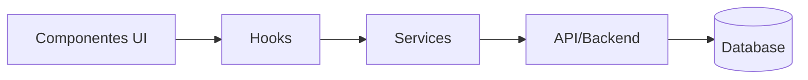

# 🏗️ Arquitetura

## Tipo de Arquitetura

`[TO-DO]` (Monolito / Feature-based / Layer-based / Microservices)

## Árvore de Pastas Principal

```
src/
├── components/     # Componentes visuais reutilizáveis
├── pages/          # Páginas/Rotas
├── hooks/          # Custom Hooks
├── services/       # Lógica de negócio e API calls
├── utils/          # Utilitários puros
├── types/          # TypeScript interfaces/types
├── styles/         # CSS/Design tokens
└── assets/         # Imagens, ícones, fontes
```

> [!NOTE]
> Atualize esta árvore para refletir a estrutura real do projeto.

## Fluxo de Dados



## Decisões Arquiteturais

| Decisão | Escolha | Motivo |
|---------|---------|--------|
| Gerenciador de Estado | `[TO-DO]` | `[TO-DO]` |
| Roteamento | `[TO-DO]` | `[TO-DO]` |
| Estilização | `[TO-DO]` | `[TO-DO]` |
