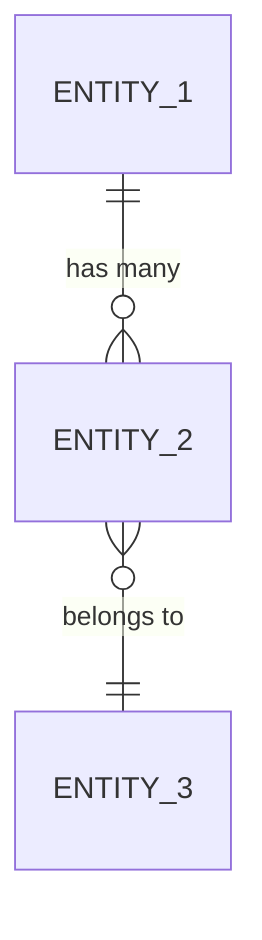

# 💾 Modelo de Dados

## Entidades Principais

### `[TO-DO]` (Entidade 1)

| Campo | Tipo | Obrigatório | Descrição |
|-------|------|-------------|-----------|
| `id` | `string (UUID)` | ✅ | Identificador único |
| `[TO-DO]` | `[TO-DO]` | `[TO-DO]` | `[TO-DO]` |
| `created_at` | `timestamp` | ✅ | Data de criação |
| `updated_at` | `timestamp` | ✅ | Última atualização |

### `[TO-DO]` (Entidade 2)

| Campo | Tipo | Obrigatório | Descrição |
|-------|------|-------------|-----------|
| `id` | `string (UUID)` | ✅ | Identificador único |
| `[TO-DO]` | `[TO-DO]` | `[TO-DO]` | `[TO-DO]` |

## Relacionamentos

## Fonte de Dados

| Entidade | Origem | Tipo |
|----------|--------|------|
| `[TO-DO]` | `[TO-DO]` | REST API / Supabase / Local |

