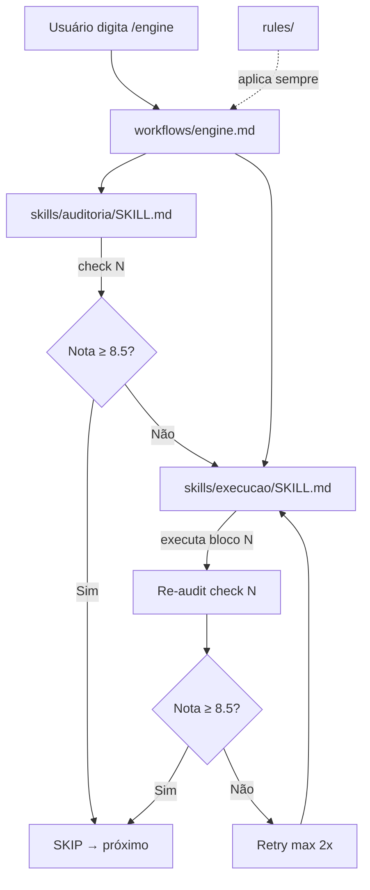

# 🏗️ Arquitetura

## Tipo de Arquitetura

Framework de Agentes — organização modular por camada funcional.

## Árvore de Pastas

```
.agents/
├── README.md                           # Quick start — ponto de entrada
├── rules/                              # Regras always-on
│   ├── universal.md                    # Qualidade, idioma, filosofia
│   ├── zero-any-tolerance.md           # Anti-any em TypeScript
│   └── design-system.md               # Anti-hardcode visual
├── skills/                             # Capacidades reutilizáveis
│   ├── audit/
│   │   └── SKILL.md                    # 19 checks diagnósticos read-only
│   ├── execucao/
│   │   └── SKILL.md                    # 19 blocos de ação
│   ├── context-memory/
│   │   ├── SKILL.md                    # Gestão da pasta .context
│   │   └── templates/                  # 10 templates de documentação
│           ├── 00_meta.md
│           ├── 10_architecture.md
│           ├── 20_tech_stack.md
│           ├── 30_coding_standards.md
│           ├── 40_product_specs.md
│           ├── 50_ui_ux_guide.md
│           ├── 60_data_model.md
│           ├── 70_api_reference.md
│           ├── 80_changelog.md
│           └── 90_active_memory.md
└── workflows/                          # Slash commands
    ├── audit.md                        # /audit — 19 checks completos
    ├── audit-quick.md                  # /audit-quick — 6 checks essenciais
    ├── engine.md                       # /engine — pipeline self-driving
    ├── context-init.md                 # /context-init — setup .context
    ├── detox.md                        # /detox — limpeza + sanitização
    ├── polish.md                       # /polish — visual + UX
    └── preflight.md                    # /preflight — checklist pré-deploy
```

## Fluxo de Dados



## Decisões Arquiteturais

| Decisão | Escolha | Motivo |
|---------|---------|--------|
| Skills separadas | audit + engine + context-memory | Token economy — cada workflow carrega só o necessário |
| Ciclo por bloco | Audit → Execute → Verify | Garante qualidade incremental com threshold 8.5 |
| Detecção de stack | Check 00 classifica projeto | Permite pular checks/blocos N/A automaticamente |
| Templates em branco | Marcadores `[EXTRAIR]` | IA preenche após análise real do projeto |
